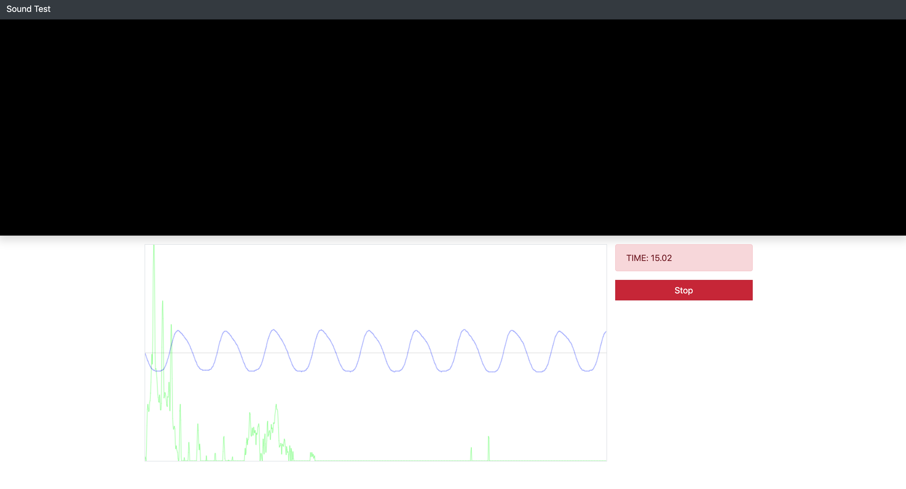

# go-voice


## Try it

1. `static/index.html`



```
$ docker build -f Dockerfile -t go-voice .
$ docker start go-voice
$ docker stop go-voice
$ docker rm go-voice
```


<p align="center">
  <br>
  <a href=""><strong>Takenoko Tech.</strong></a>
</p>